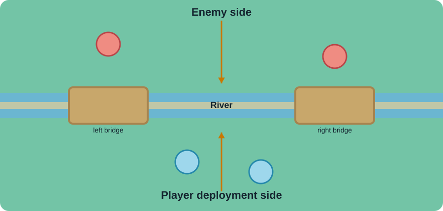
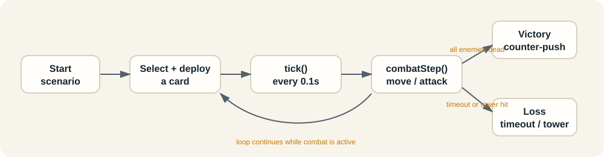

# How `gameplay_prototype.html` works

This walkthrough explains the prototype as a small real-time defense game. The page is self-contained: its layout, styling, card data, simulation, animations, and debug controls all live in [`gameplay_prototype.html`](./gameplay_prototype.html).

## 1. The player-facing experience

The page presents one lesson: defeat the enemy Wizard before the timer expires while spending no more elixir than the enemy’s card cost.



The arena is split into three gameplay regions:

- Enemy units begin on the upper side.
- Ground units need one of the two bridges to cross the river.
- Player cards can only be deployed on the lower side; air units ignore the bridge restriction.

The HUD shows current elixir, the defense budget, and the remaining time. The hand is reusable, but each placement permanently increases `usedElixir`, so “reusable” does not mean free.

## 2. The main runtime loop



### Starting a scenario

`start()` resets the run state, calculates the enemy budget, places enemy units, enables affordable cards, and starts a timer:

```js
state.timer = setInterval(tick, 100)
```

The 100 ms interval makes the simulation advance in 0.1-second steps. It is intentionally simple and readable rather than frame-perfect.

### Each simulation tick

`tick()` advances `state.elapsed` by `0.1`, then branches by phase:

1. In `combat`, regenerate elixir, run movement and attacks, then check for victory or timeout.
2. In `victory`, move surviving player units toward the enemy towers.
3. In `towerHit`, wait for the fireball animation window before ending in a loss.
4. Re-render units, card availability, and HUD values.

This makes the page a state machine driven by one central clock rather than many independent timers.

## 3. Card data drives behavior

The `CARD_DATA` object is the prototype’s rules table. Each card defines its icon, cost, health, damage, attack speed, first-hit delay, range, movement speed, valid targets, splash radius, unit count, and whether it is airborne.

| Card | Cost | Units | Targets | Splash | Role in the prototype |
| --- | ---: | ---: | --- | ---: | --- |
| Wizard | 5 | 1 | Air + ground | 1.5 | Enemy splash attacker |
| Executioner | 5 | 1 | Air + ground | 2 | Direct splash counter |
| Valkyrie | 4 | 1 | Ground | 1.2 | Durable ground splash |
| Skeletons | 1 | 3 | Ground | 0 | Cheap distraction |
| Bats | 2 | 5 | Air + ground | 0 | Fast air pressure |
| Minions | 3 | 3 | Air + ground | 0 | Air damage |
| Knight | 3 | 1 | Ground | 0 | Durable single-target unit |
| Giant | 5 | 1 | Ground | 0 | Slow high-health unit |

`makeUnit()` converts one card definition into a live unit. For cards with multiple units, such as Skeletons or Bats, it creates one unit object per member and spreads them slightly around the deployment point.

## 4. Selecting and deploying a card

The interaction is intentionally two-step:

1. Click a card in the hand.
2. Click a location in the lower half of the arena.

`selectCard()` checks that the scenario is live, that enough elixir is available, and that the new placement would not exceed the enemy budget. It then activates `#targetZone` so the player can choose a location.

The arena click handler converts the mouse position into percentages relative to the arena. Deployments above `y < 56` are rejected, which enforces the player-side boundary while leaving a small buffer around the river.

`deployCard()` subtracts the card cost from current elixir, adds it to `usedElixir`, creates the unit or units, and immediately refreshes the HUD.

## 5. Targeting, movement, and attacks

`combatStep(dt)` processes every living unit:

- `nearestTarget()` finds the closest legal opposing unit, respecting air/ground targeting.
- If an attack cooldown has expired, `dealDamage()` applies damage.
- If no unit is in range, `moveUnit()` advances the unit toward its pursuit target.
- Enemy units can attack a Princess Tower when `nearestPrincessTower()` says the tower is in range.

Ground movement uses the nearest bridge lane when a unit must cross the river. Air movement uses direct x/y movement, so Bats and Minions can fly over the river.

The prototype also separates same-team units with `separateUnits()` to reduce visual overlap. This is a presentation safeguard, not a full collision system.

## 6. Splash damage and defeat rules

`dealDamage()` first damages the primary target. If the attacker has a nonzero `splash` radius, it scans nearby opposing units and applies the same damage to any unit inside that radius.

`markDefeated()` does not remove a unit instantly. It marks the unit as dying and gives the CSS death animation time to play. This is why the code distinguishes between:

- `hp <= 0`: the unit has no remaining health;
- `dying`: the unit is in its visual defeat animation;
- `dyingUntil`: the timestamp after which it can be removed from the simulation.

That small delay keeps the visual result readable while still allowing the win check to treat the enemy as defeated.

## 7. Win and loss conditions

The scenario has four meaningful outcomes:

- **Win:** every enemy unit is defeated, then the surviving player units counter-push for several seconds before the result overlay appears.
- **Timeout loss:** the configured duration expires while at least one enemy remains alive.
- **Tower loss:** the Wizard reaches Princess Tower range and launches a fireball. The scenario enters `towerHit`, plays the projectile animation, then ends in a loss.
- **Push loss:** an enemy reaches the tower before the defense is completed.

The budget condition is enforced during deployment rather than only at the end. With the default Wizard, the enemy budget is 5 elixir, so a 5-elixir Executioner is valid, while a second deployment that would take the total above 5 is blocked.

## 8. Victory sequence

When no enemies remain, `beginVictory()` changes the phase to `victory`, disables further card play, and updates the arena message. After a short delay, `victoryStep()` changes the phase to `victoryPush` and moves surviving player units forward.

This sequence communicates an important lesson: a successful defense is not only about surviving; the remaining troops can create counter-pressure.

## 9. Debug creator

The collapsible **Debug creator** turns the lesson into a sandbox. It can change:

- timer duration;
- starting elixir;
- available player cards;
- enemy cards;
- enemy placement: back, middle, or bridge.

`applyDebug` clamps numeric inputs to safe ranges, parses comma-separated card names, rebuilds the hand, and starts a new scenario. `resetDebug` restores the default Wizard lesson.

Unknown card names do not crash the page: `cardInfo()` supplies a fallback unit definition with a question-mark icon. That makes the sandbox forgiving while still exposing the card-data-driven design.

## 10. Suggested ways to read or extend the prototype

For a quick code tour, read in this order:

1. `CARD_DATA` — the rules vocabulary.
2. `start()` and `tick()` — lifecycle and timing.
3. `selectCard()` and `deployCard()` — player interaction.
4. `combatStep()` and `moveUnit()` — simulation behavior.
5. `dealDamage()` and `markDefeated()` — combat resolution.
6. `beginVictory()` and `end()` — result states.

Good next extensions would be per-tower health, distinct splash damage falloff, a real card cycle, attack targeting priorities, and a replay/event log for teaching why a defense succeeded or failed.
